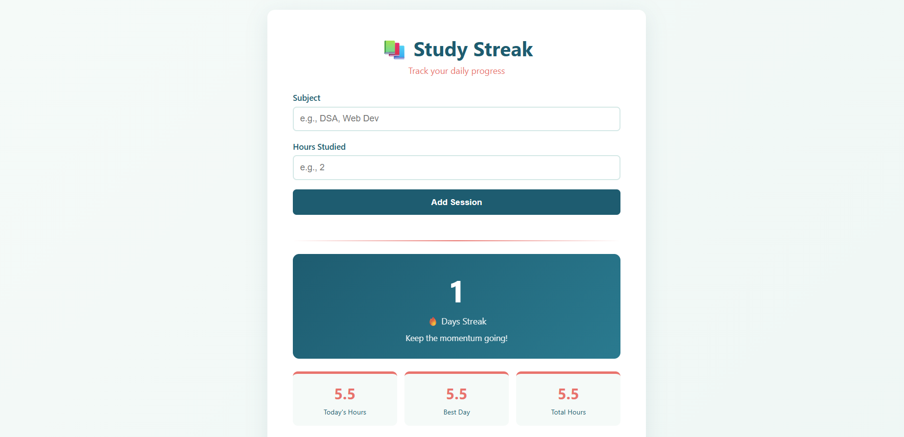
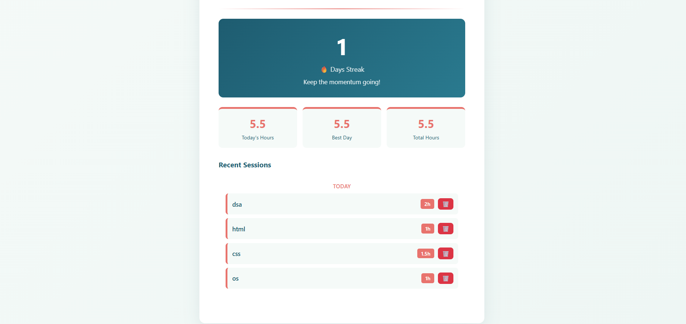

# Study Streak Tracker - SQLite Database Edition
🗄️ Express Backend + SQLite Persistence  
DecodeLabs Full Stack Development Internship — Project 3: Database Integration

---

## Overview

An enhanced full-stack application for tracking study sessions using SQLite database. This project demonstrates database schema design, CRUD operations, and proper data persistence with SQL queries.

---

## Features

✅ **SQLite Database** — Persistent data storage with SQL  
✅ **Add Study Sessions** — Log subject and hours  
✅ **Track Streak** — Calculate consecutive study days  
✅ **View Statistics** — Today's hours, best day, total hours  
✅ **Delete Sessions** — Remove sessions with confirmation  
✅ **Real-time Updates** — Instant data refresh  

---

## Tech Stack

- **Frontend:** HTML5, CSS3, JavaScript
- **Backend:** Node.js, Express.js
- **Database:** SQLite3
- **API:** RESTful endpoints with CORS

---

## Project Structure
study-streak-tracker-3/

├── app.js                 (Backend with SQLite)

├── index.html             (Frontend UI)

├── package.json           (Dependencies)

├── db/

│   └── database.db        (SQLite database file)

└── README.md

---

## Database Schema

**sessions table:**
```sql
CREATE TABLE sessions (
  id INTEGER PRIMARY KEY AUTOINCREMENT,
  subject TEXT NOT NULL,
  hours REAL NOT NULL,
  date TEXT NOT NULL,
  createdAt TEXT DEFAULT CURRENT_TIMESTAMP
);
```

---

## API Endpoints

| Method | Endpoint | Description |
|--------|----------|-------------|
| POST | `/study` | Add a new study session |
| GET | `/study` | Get all study sessions |
| GET | `/streak` | Get current streak |
| DELETE | `/study/:id` | Delete a session |

---

## How to Run

### Prerequisites
- Node.js installed

### Installation & Setup

1. **Clone the repository**
git clone <your-repo-url>

cd study-streak-tracker-3

2. **Install dependencies**
npm install

3. **Start the server**
npm start

4. **Open in browser**
http://localhost:3000/index.html

---

## Usage

1. Enter a subject name (e.g., DSA, Web Dev)
2. Enter hours studied (e.g., 2)
3. Click "Add Session" to save to database
4. View your statistics:
   - Current streak (consecutive days)
   - Today's hours
   - Best day (highest hours in one day)
   - Total hours studied
5. Delete any session with the 🗑️ button

---

## Screenshot




---

## Key Learnings

- SQLite database setup & configuration
- SQL query execution (SELECT, INSERT, DELETE)
- Database schema design
- Asynchronous database operations
- CRUD operations with SQL
- Data validation & error handling
- CORS implementation

---

## Differences from Project 2

| Feature | Project 2 | Project 3 |
|---------|-----------|----------|
| Storage | JSON file | SQLite database |
| Queries | File read/write | SQL queries |
| Schema | Dynamic | Defined table structure |
| Scalability | Limited | Better for larger datasets |

---

## Author

Built by Rishika as Project 3 for DecodeLabs Internship

---

## License

ISC
